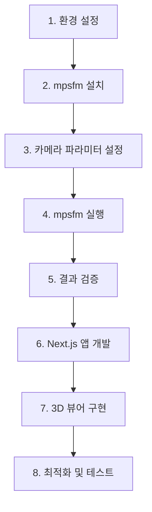

# FAVIEW-RENEWED 프로젝트 계획

## 프로젝트 개요

| 항목 | 내용 |
|------|------|
| **프로젝트명** | faview-renewed |
| **목적** | MP-SfM을 활용한 파노라마 이미지 3D 재구성 및 시각화 |
| **기술 스택** | Next.js, TypeScript, Tailwind CSS, Python |
| **우선순위** | MVP + 성능 최적화 |

---

## Phase 1: 환경 구성 및 MP-SfM 설치

### 1.1 Python 환경 설정
```bash
# Python 가상환경 생성
python3 -m venv venv
source venv/bin/activate

# mpsfm 클론 및 설치
git clone --recursive https://github.com/cvg/mpsfm
cd mpsfm
pip install -r requirements.txt
pip install -e .
```

### 1.2 필수 의존성
- CUDA 지원 GPU (권장)
- Python 3.10+
- PyTorch with CUDA
- COLMAP

---

## Phase 2: MP-SfM 실행

### 2.1 입력 데이터
- **위치**: `input_panoramas/`
- **이미지 수**: 24개
- **형식**: JPG (파노라마)

### 2.2 카메라 파라미터 설정
```yaml
# intrinsics.yaml
1:
  params: [fx, fy, cx, cy]  # 파노라마 카메라 내재값
  images: all
```

### 2.3 실행 스크립트
```python
# run_mpsfm.py
from mpsfm import Pipeline

pipeline = Pipeline(
    image_dir="input_panoramas",
    output_dir="sfm_outputs",
    matcher="superpoint+lightglue",
    depth_estimator="metric3dv2"
)
pipeline.run()
```

### 2.4 예상 출력물
```
sfm_outputs/
├── sparse/           # 희소 3D 점군
├── cameras.bin       # 카메라 포즈
├── images.bin        # 이미지 메타데이터
├── points3D.bin      # 3D 포인트
├── depth_maps/       # 깊이 맵
├── normal_maps/      # 법선 맵
└── visualization.html # 3D 시각화
```

---

## Phase 3: Next.js 시각화 앱

### 3.1 프로젝트 구조
```
faview-renewed/
├── app/                    # Next.js App Router
│   ├── layout.tsx
│   ├── page.tsx           # 메인 대시보드
│   ├── viewer/
│   │   └── page.tsx       # 3D 뷰어
│   └── api/
│       ├── sfm/
│       │   └── route.ts   # SfM 실행 API
│       └── results/
│           └── route.ts   # 결과 조회 API
├── components/
│   ├── PointCloudViewer.tsx   # Three.js 3D 뷰어
│   ├── ImageGallery.tsx       # 입력 이미지 갤러리
│   ├── DepthMapView.tsx       # 깊이맵 시각화
│   └── ProcessingStatus.tsx   # 처리 상태 표시
├── lib/
│   ├── mpsfm-runner.ts    # Python 스크립트 실행
│   └── result-parser.ts   # 결과 파싱
├── input_panoramas/       # 입력 이미지
├── sfm_outputs/          # MP-SfM 결과
├── mpsfm/                # MP-SfM 라이브러리
└── scripts/
    └── run_mpsfm.py      # SfM 실행 스크립트
```

### 3.2 핵심 컴포넌트

#### PointCloudViewer (Three.js)
- PLY/BIN 포인트 클라우드 로드
- 카메라 포즈 시각화
- 인터랙티브 네비게이션

#### DepthMapView
- 깊이맵 컬러맵 렌더링
- 이미지 오버레이 비교

#### ProcessingStatus
- 실시간 처리 진행률
- 로그 스트리밍

### 3.3 API 엔드포인트

| Endpoint | Method | 설명 |
|----------|--------|------|
| `/api/sfm/run` | POST | MP-SfM 실행 시작 |
| `/api/sfm/status` | GET | 처리 상태 확인 |
| `/api/results/pointcloud` | GET | 3D 포인트 클라우드 |
| `/api/results/depth` | GET | 깊이맵 데이터 |
| `/api/results/cameras` | GET | 카메라 포즈 |

---

## Phase 4: 성능 최적화

### 4.1 백엔드 최적화
- GPU 가속 활용 (xformers, CUDA kernels)
- 병렬 이미지 처리
- 결과 캐싱

### 4.2 프론트엔드 최적화
- 포인트 클라우드 LOD (Level of Detail)
- WebGL 인스턴싱
- 점진적 로딩

---

## 실행 순서



---

## 예상 소요 리소스

| 단계 | GPU 메모리 | 디스크 |
|------|-----------|--------|
| 특징 추출 | ~4GB | - |
| 매칭 | ~8GB | - |
| 깊이 추정 | ~12GB | - |
| SfM 재구성 | ~4GB | ~2GB |

---

## 다음 단계

1. [ ] Python 환경 및 mpsfm 설치
2. [ ] 파노라마 이미지용 카메라 파라미터 설정
3. [ ] mpsfm 테스트 실행
4. [ ] 결과물 확인 및 검증
5. [ ] Next.js 프로젝트 초기화
6. [ ] 3D 뷰어 컴포넌트 구현
